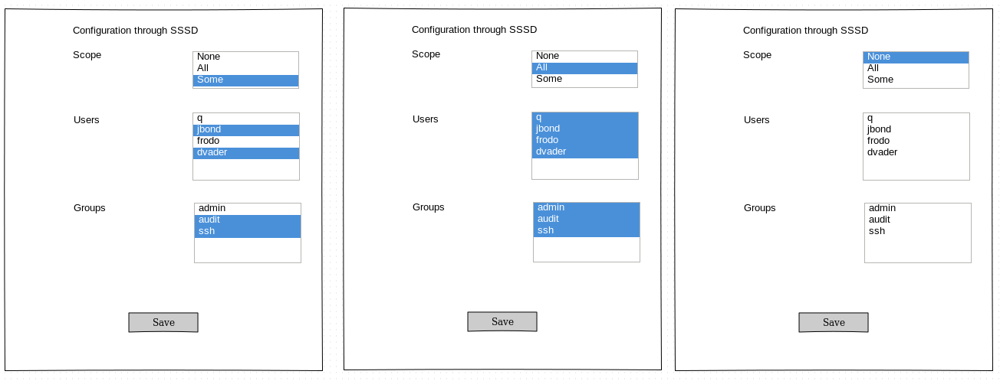

# Session Recording Design ideas for Cockpit

For now we are using system’s Journal to store recorded sessions and tlog-rec-session is used to record sessions. In future our plan is to use Kibana and Elastic.

For now on Recording page terminal is launched with command tlog-play to play recorded session. In future our own JavaScript-based player will be created to allow more control over playback of recorded session.

Session Recording menu item should be kept for list of all recorded sessions in the system.
It will provide configuration options.

## Particular user’s Account page

* List of recorded user’s sessions with date-pickers ( we can just show existing component filtered for selected user )
* Each item on list on click will open recording page ( same if you open this recording from Session Recording page )

One more option is to simply put a filter link on Account page which will open list of recorded session for particular user.

## Page “Session Recording”

* List of all logs with filters by date and user ( same list which we have now )
* Configuration of Session Recording through SSSD + configuration without SSSD ( possibly )

## My suggestions how it might look like are:    
* Modal for configuration, button near datepickers
* Buttons to select ( e.g. like on page Services ) - “Logs”, “Configuration” - two separate tabs
* Small button with icon to show configuration instead of logs - on the left side before “Date Since”.
* At the end of a table we can put arrow to open configuration, but on the fresh system this arrow will be somehow colored to get attention and after the configuration is done it won’t so visible anymore ( gray color or something ).
* Combined style of “System” and “Logs” pages - configuration on the left side and logs on the right side. Filters might be as a modal window.

I think option #2 is better for future flexibility, because other things might be added.

To configure session recording without SSSD - checkbox + input field for desired shell might be added to Session Recording configuration page.

#### Here are some useful links about SSSD:
* http://cockpit-project.org/guide/latest/sso.html
* http://cockpit-project.org/guide/latest/feature-realmd.html
* https://pagure.io/SSSD/sssd/blob/master/f/src/man/sssd.conf.5.xml#_1521
* https://pagure.io/SSSD/sssd/blob/master/f/src/man/sssd-session-recording.5.xml

Description of tlog
https://github.com/Scribery/tlog
