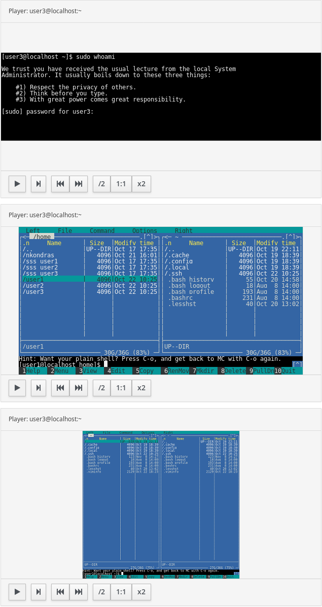
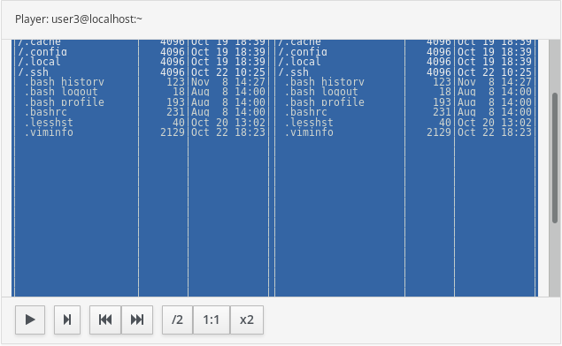

User Stories for Session Recording Playback
===========================================

Present document describes user stories related to playback functionality of
the recorded sessions stored on a local host or streamed into Elastic as part
of Red Hat common logging solution.

Session navigation
------------------

### Assumptions

The users stories in this section are related to identifying and navigating to
a specific session that was previously recorded so that user can watch it. All
stories assume that a user opens some kind of web UI and navigates to a page
that allows her to select a session she wants to play. Once the session is
selected the player is launched or user navigates to a player page (up to UXD).

Each session has at least the following properties: 

* User that started the session 
* Time the session was started
* Host the session was recorded on

Also sessions have a unique ID. Session IDs are useful to know but hard to
search by.

### Stories

As an administrator of a specific system or a cluster of systems I want to have
a way to find the session to play, so that I can play the session I want, and
see what was happening during the session.

* The list of the sessions I pick from should allow me to visually observe
   * Time the session was started
   * User that started the session
   * Host the session was recorded on (in cluster case only)
   * Session ID
   * Length of the session
* The list presented to me should allow grouping by
   * Host (in cluster case only)
   * User
   * Day the session was started
* The UI should allow me to change the grouping
* Range:
   * I should be able to choose the sessions that were recorded during a
     specific period of time. 
   * I should be able to enter the range to narrow the search.
   * I should be able to alter the range to widen or to further narrow down the
     search
   * The range should have reasonable defaults (for example last 30 days) when
     the selection screen is presented
   * The range should allow up to minute granularity with hour-aligned
     defaults
   * The controls should be user friendly, so that I do not have to type date
     or time as text into the search criteria, but could select some
     pre-defined ranges
   * The range might be expressed as a range of dates as well as a range from
     now till X days back

* User:
   * I should be able to choose sessions that were recorded for a specific
     user login (within the given range and grouped as I selected)
   * I should be able to specify a wildcard, in this case all sessions that
     match a user wildcard should be presented (within the given range and
     grouped as I selected)
   * If I do not specify the user, I should be able to see all the sessions
     for a given host/range
   * Future:
      * I should be able to specify a group by selecting one of the known
        groups from the list (locally- or centrally-managed groups) and filter
        only the sessions that belong to users that are members of a specific
        group
      * I should be able to specify a group by a wildcard
* Host (only in the cluster version of the UI)
   * I should be able to choose sessions that were recorded on a specific host
     identified by FQDN (within the given time range and grouped as I
     selected)  
   * I should be able to specify a wildcard, in this case all sessions that
     match a host wildcard should be presented (within the given time range
     and grouped as I selected)
   * If I do not specify host I should be able to see all the sessions (within
     the given time range and grouped as I selected)
   * Future:
      * I should be able to specify a group by selecting one of the known
        groups from the list (locally- or centrally-managed groups) and filter
        only sessions that belong to host that are members of a specific group
      * I should be able to specify a group by a wildcard

* The style of UI for individual host case or for a cluster should be the same
  and should differ only in presence of the host-related information for
  grouping and filtering

* I should be able to save my filter and grouping for future use, so that when
  next time I get to select a session, my default choices are already selected

* Future:
   * I want to be able to save more than one filter so that I can use them as
     saved searches in addition to the default one.

* Integration
   * Local UI
      * The local UI should be integrated with Cockpit
      * Local UI should read the sessions from a local hard drive
      * Local UI should not present host grouping

   * Central UI
      * Should be embeddable into any Patternfly-based UI like IPA or
        CloudForms
         * The actual shell UI is TBD.
      * Should read session information from Elasticsearch using Elasticsearch
        queries

Player
------

### Assumptions

Player is launched when a session to play is chosen by the user. It is assumed
that player is not going to replace the navigation UI but rather be in a
separate window on the same page or as a pop-up.

### Stories

As an administrator of a system or cluster I want to be able to playback a
session that was recorded so that I can see what was happening for
troubleshooting, auditing or forensic reasons.

I want to be able to:

* Start watching the selected session (playback should start automatically
  when I select session to play after a comfortable pause)
* Stop the session playback
* Jump to a specific place in the playback using a progress bar
* Nice to have: 
   * Speed up the playback
   * Slow down the playback
   * See how the screen will look like if I put mouse on the progress bar
* Search session playback by a string and jump right to the place where the string appears on the screen
   * Find next should allow me to move forward to the next occurrence 
   * Text being searched should be highlighted in the playback window
     (probably using inverse colors)
* Save a specific place in playback as a URL so that I can share it with some
  other person
* Launch several playbacks at the same time and compare sessions side by side
* Highlight a line or several adjacent lines in the stopped playback
* Launch/close or open/hide log feed correlation
* Allow skipping inactivity period, both in terminal I/O and in correlated
  logs
   * If the session was idle for several hours I do not want to sit and watch
     it for these hours. I want to be able to jump to a couple seconds ahead
     of time when next burst of activity started to happen.
* Reach the playback controls in the same place at all times during playback,
  and see the whole of the terminal, no matter how the recorded terminal was
  resized. Have the output terminal resized to fit and centered at all times,
  with aspect ratio preserved and edges clearly visible.

  
* Use screen space efficiently, if need be, and make the playback area
  occupy as much of the page as possible, or even the whole screen, as an
  option.
* Change output terminal zoom level, with ability to scroll/pan about, to be
  able to see details in a recording of a big terminal in a small playback
  area. E.g. when playing back a recording of a big monitor on a laptop
  screen.

  

Log Correlator
--------------

### Assumptions

At the same time as session is recorded other log feeds can be collected from
the system, for example syslog, journal, auditd. The session can be correlated
back with those logs. When the correlation is launched/enabled user should see
two windows side by side, one for player and another for logs. There might be
several log sources as mentioned above. It is assumed that log correlator
would be only possible in the cluster case however if it is easy to do on a
local system would be great to have it.

### Stories

As an administrator of a cluster I want to be able to playback a session that
was recorded and see what was happening on the system under the hood at the
same time as the user session was active so that I can determine whether there
was any kind of damage caused by such activity.

I should be able:

* As recorded session plays back see the logs from that system that match the
  same time
* I should be able to define which log feeds I want to see (if any)
* If playback is stopped and some lines are highlighted in the playback window
  I should be able to see a range of the logs highlighted in the log window so
  that I know that an activity in the playback window corresponds to
  highlighted logs
   * I should be able to scroll the log window back and forth independently
     while the session playback is paused.
   * As soon as playback is resumed the playback in both windows should sync
     up.
   * For any entry in the log window I should be able to position the terminal
     playback to the entry time, for example by double-clicking it.
* I should be able to close or hide (open or unhide) the log playback window
  if I do not want to see the logs. 
   * Deselecting all log sources does not hide the log window, it will just be
     kept blank
